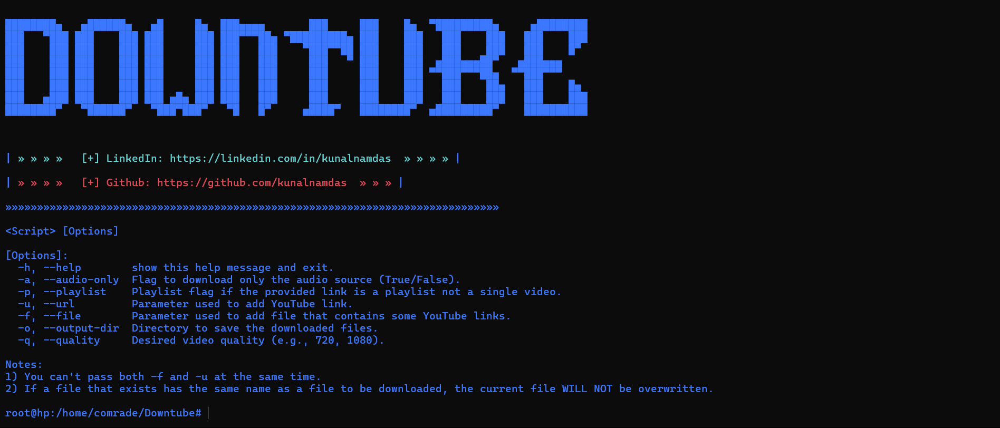
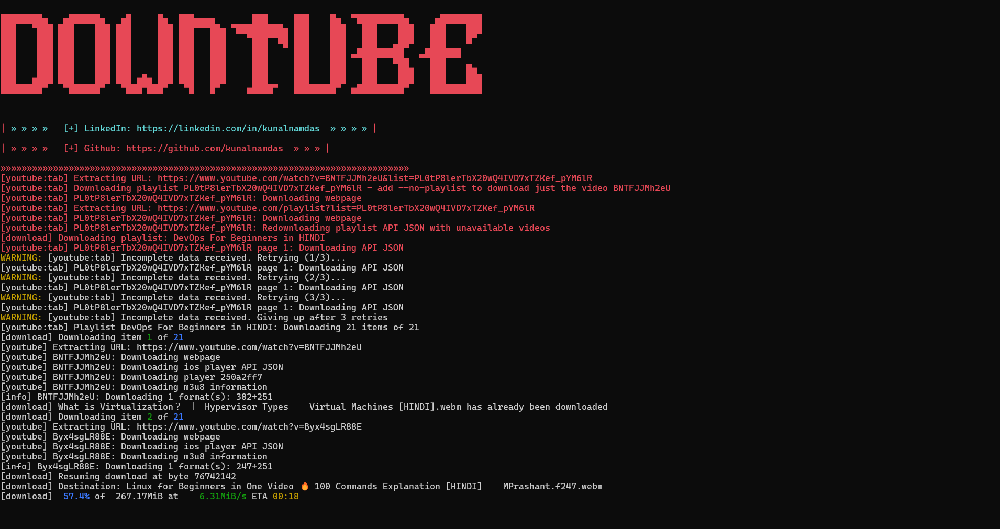

# DownTube.py

DownTube.py is a YouTube Video/Audio downloader script that allows you to download videos or audio from YouTube, supporting various options like quality selection, playlist downloading, and saving to specific directories.

## Features

- Download single YouTube videos.
- Download entire playlists.
- Download audio-only files.
- Specify the output directory.
- Choose video quality (e.g., 720p, 1080p).
- Gracefully handle interruptions (Ctrl + C).




## Usage

### Basic Commands

1. **Download a Single Video in 720p**:
   ```bash
   python DownTube.py --url "https://www.youtube.com/watch?v=example"
   ```

### Download Only Audio:
- python DownTube.py --url "https://www.youtube.com/watch?v=example" --audio-only

### Download a Playlist:
- python DownTube.py --url "https://www.youtube.com/playlist?list=example" --playlist

### Download from a File of Links:
-python DownTube.py --file "path/to/file.txt"

## Additional Arguments
### Specify Output Directory:
- python DownTube.py --url "https://www.youtube.com/watch?v=example" --output-dir "my_downloads"

### Specify Video Quality:
- python DownTube.py --url "https://www.youtube.com/watch?v=example" --quality 1080

### Combining Options:
- Download a playlist in 1080p and save to a specific directory:

- python DownTube.py --url "https://www.youtube.com/playlist?list=example" --playlist --quality 1080 --output-dir "my_downloads"

Download only audio from a list of links in a file:

- python DownTube.py --file "path/to/file.txt" --audio-only


##  Handling Interruptions
- When running any of these commands, if you press Ctrl + C, the script will gracefully stop and display the message "Program stopped successfully."

# Setup
### Install Dependencies:
- Make sure you have yt-dlp installed. You can install it using pip:

- pip install yt-dlp
  
### Setup ffmpeg:
- ffmpeg is required for processing video and audio quality. Install it as follows:

### Windows:
- Download ffmpeg from FFmpeg official website, extract it, and add the bin folder to your system's PATH.

### macOS:
- Install ffmpeg using Homebrew:
- brew install ffmpeg
  
### Linux:
- Install ffmpeg using your package manager. For example, on Ubuntu:
- sudo apt update
- sudo apt install ffmpeg
- Run the Script:
- Use any of the commands mentioned in the Usage section to run the script.

## Logging
The script logs its activity in a file named downloader.log in the current directory. This log file includes information about successful downloads and any errors encountered.
   
